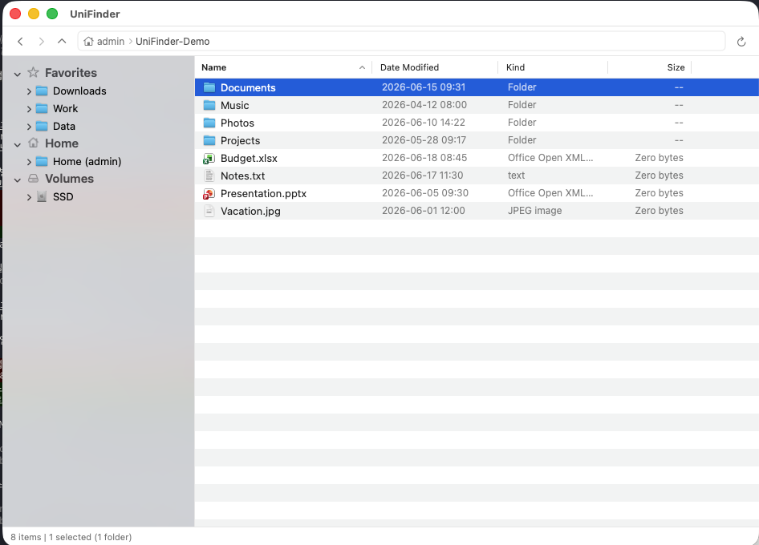

<p align="center">
  
</p>

# UniFinder

macOS 기본 Finder 대신 쓸 수 있는, **Windows 탐색기 스타일의 2단 화면 파일 탐색기**입니다.

왼쪽에는 폴더 목록, 오른쪽에는 선택한 폴더의 파일 목록이 보이는 익숙한 구성으로, Windows를 쓰다 오신 분들도 바로 적응할 수 있습니다. 메뉴와 단축키는 macOS 방식(Finder와 동일)을 그대로 따르기 때문에 Mac 사용법도 그대로 유지됩니다.



| | |
|---|---|
| **버전** | 0.5.0 |
| **필요 사양** | macOS 14 (Sonoma) 이상 |

---

## 이런 점이 좋아요

**두 개로 나뉜 화면 구성**
- 왼쪽은 폴더 트리(즐겨찾기 / 홈 / 디스크 목록), 오른쪽은 선택한 폴더의 파일과 폴더 상세 목록
- 오른쪽에서 폴더를 열면 왼쪽 트리도 자동으로 따라 펼쳐져서 지금 어디에 있는지 한눈에 파악 가능
- 뒤로가기 / 앞으로가기 / 상위 폴더 이동, 주소창에 경로 직접 입력도 가능
- 파일 이름을 입력하면 바로 해당 파일로 이동, 열 제목(이름/수정일/종류/크기)을 클릭하면 정렬
- 숨김 파일 보기/숨기기 전환
- **여러 개의 창을 동시에 사용** — 새 창을 열어 여러 폴더를 동시에 볼 수 있고, 각 창은 서로 다른 위치를 탐색해도 즐겨찾기나 설정은 공유됩니다

**파일 정리가 편해요**
- 복사 / 잘라내기 / 붙여넣기 — Windows처럼 잘라내기도 되고, Mac 방식(복사 후 옵션 붙여넣기)으로 이동도 가능
- 파일 이름을 그 자리에서 바로 변경, 휴지통으로 이동, 새 폴더 만들기
- 같은 이름의 파일이 있을 때는 "덮어쓰기 / 둘 다 보관 / 건너뛰기 / 취소" 중 선택
- 마우스로 파일을 끌어다 놓아 이동/복사 가능, Finder와도 자유롭게 주고받기 가능
- 파일 복사나 이동 중에도 다른 작업을 계속할 수 있고, 언제든 취소 가능

**그 밖의 편의 기능**
- **정보 보기(⌘I)** — 파일·폴더의 크기, 종류, 만든 날짜, 권한 등을 한 창에서 확인. 폴더는 안에 든
  내용의 크기를 자동으로 계산해 보여줍니다(계산 중에도 창은 멈추지 않습니다)
- **다음 프로그램으로 열기** — 파일을 우클릭해 원하는 앱으로 열 수 있고, 정보 보기 창에서는
  그 파일(또는 같은 종류 전체)의 기본 앱을 바꿀 수 있습니다
- **디스크 용량 보기** — 보기 메뉴에서 연결된 디스크의 남은 공간을 한눈에 확인
- **업데이트 확인** — 도움말 메뉴에서 새 버전을 확인합니다. 앱이 직접 내려받지 않고 배포 페이지를
  열어주며, 자동 확인은 하루 한 번이고 끌 수 있습니다
- 자주 쓰는 폴더를 즐겨찾기로 등록/해제
- 스페이스바로 파일 미리보기(QuickLook)
- 다른 프로그램에서 파일을 바꾸면 자동으로 화면에 반영, USB 등 외장 디스크 연결/해제도 바로 인식
- 파일 접근 권한이 필요한 경우 처음 실행 시 안내를 제공

**아직 지원하지 않는 기능** — 네트워크 드라이브 접속(회사 서버 등)은 지원하지 않습니다. 검색, 탭 기능, 실행 취소, 파일 미리보기 패널, 압축/압축 풀기, 태그 기능은 다음 업데이트에서 추가될 예정입니다.

---

## 자주 쓰는 단축키

메뉴와 단축키는 macOS Finder와 동일합니다.

| 메뉴 | 기능 | 단축키 |
|------|------|--------|
| **파일** | 새 창 | ⌘N |
| | 새 폴더 | ⇧⌘N |
| | 열기 | ⌘O |
| | 정보 보기 | ⌘I |
| | Finder에서 보기 | (메뉴에서 선택) |
| | 이름 바꾸기 | F2 |
| | 즐겨찾기 추가/제거 | ⌃⌘T |
| | 휴지통으로 이동 | ⌘⌫ |
| **편집** | 잘라내기 / 복사 / 붙여넣기 | ⌘X / ⌘C / ⌘V |
| | 여기로 이동 붙여넣기 | ⌥⌘V |
| | 전체 선택 | ⌘A |
| **보기** | 숨김 항목 표시/숨기기 | ⇧⌘. |
| | 새로고침 | ⌘R |
| | 디스크 용량 보기 | (메뉴에서 선택) |
| **이동** | 뒤로 / 앞으로 | ⌘[ / ⌘] |
| | 상위 폴더로 | ⌘↑ |
| | 폴더로 이동… | ⇧⌘G |
| **도움말** | 새 버전 확인 | (메뉴에서 선택) |

> 잘라내기·복사·붙여넣기는 지금 어디에 커서가 있는지에 따라 다르게 동작합니다. 주소창이나 이름 편집 중이라면 글자에 적용되고, 그 외에는 선택한 파일에 적용됩니다.

---

## 설치 방법

1. 이 저장소에서 앱을 내려받습니다.
2. 터미널에서 아래 명령을 실행하면 앱이 자동으로 빌드되어 `/Applications` 폴더에 설치됩니다.

   ```bash
   ./scripts/install-local.sh
   ```

3. 설치가 끝나면 `Applications` 폴더에서 UniFinder를 실행하면 됩니다.

더 자세한 설치 단계와 문제 해결 방법은 [INSTALL.md](INSTALL.md) 문서를 참고하세요.

> 이 앱은 아직 정식 배포용 인증(공증)을 받지 않았습니다. 처음 실행할 때 macOS에서 보안 경고가 뜰 수 있으며, 이 경우 INSTALL.md의 안내를 따라주세요.

---

## 라이선스

미정.
